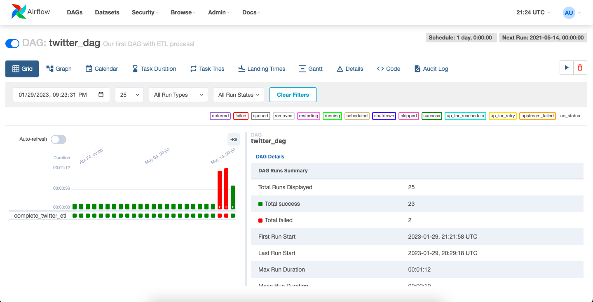

# Twitter API Data Engineering Project

## Project Overview

The purpose of this project is to use the Twitter API to scrape tweet & user data and create a data pipeline using Airflow.

## Project Steps

1. Create Account/Log In to the Twitter API and copy the necessary credentials for our Python function
2. Write a Python file (etl_twitter.py) for our etl function
3. Write a Python file (twitter_dag.py) to define our DAG within Airflow
4. Create an EC2 instance on AWS using Ubuntu
5. Create an S3 Bucket
6. Connect to the EC2 instance and run the code in "EC2_Ubuntu_Commands.sh"
7. Open the Airflow UI, run the DAG, and ensure that the pipeline worked successfully by checking it's status and the S3 Bucket associated

